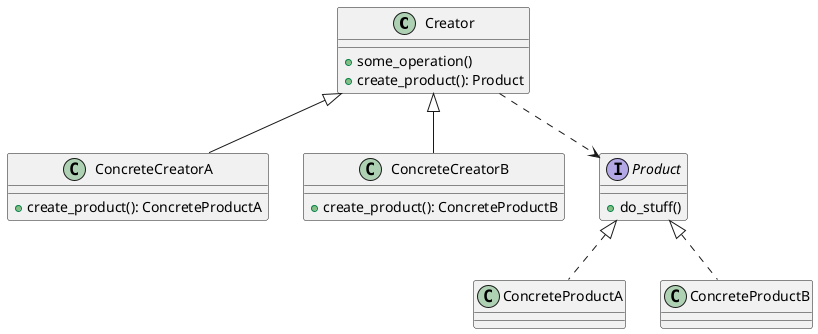

# Rust Basics

Rust 基础知识及代码实现

## Rust Algorithms

Rust 算法与数据结构

参考: 

- [The Algorithms](https://the-algorithms.com/language/rust)

## Rust Design Patterns

Rust 设计模式

参考:

- [Dive Into DESIGN PATTERNS](https://refactoringguru.cn/design-patterns/catalog)

### 工厂方法 (Factory Method)

**工厂方法模式**是一种创建型设计模式， 其在父类中提供一个创建对象的方法， 允许子类决定实例化对象的类型。

#### 结构

#### 应用场景

- 当你在编写代码的过程中， 如果无法预知对象确切类别及其依赖关系时， 可使用工厂方法。

- 如果你希望用户能扩展你软件库或框架的内部组件， 可使用工厂方法。

- 如果你希望复用现有对象来节省系统资源， 而不是每次都重新创建对象， 可使用工厂方法。

#### 解决问题

- 可以避免创建者和具体产品之间的紧密耦合。

- ️️️*单一职责原则*。 你可以将产品创建代码放在程序的单一位置， 从而使得代码更容易维护。

- *开闭原则*。 无需更改现有客户端代码， 你就可以在程序中引入新的产品类型。

#### 局限

- 应用工厂方法模式需要引入许多新的子类， 代码可能会因此变得更复杂。 最好的情况是将该模式引入创建者类的现有层次结构中。
