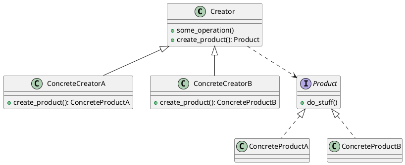
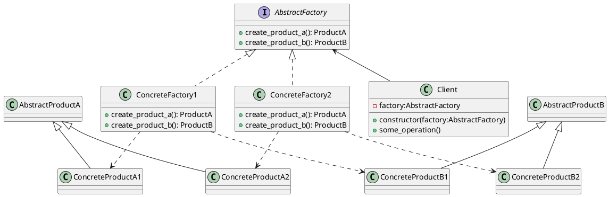

# Rust Basics

Rust 基础知识及代码实现

## Rust Algorithms

Rust 算法与数据结构

参考:

- [The Algorithms](https://the-algorithms.com/language/rust)
- [谁教你这么剪的 | 11大排序的原理讲解和Python源码剖析](https://www.bilibili.com/video/BV1Zs4y1X7mN)

### 基于比较的排序算法 (Comparison Based Sorting Algorithm)

|         算法名称         |    平均时间复杂度    | 最好情况时间复杂度 |  最坏情况时间复杂度  |   空间复杂度    | 是否稳定 |                                说明                                |
| ------------------------ | ------------------ | ---------------- | ------------------ | ------------- | -------- | ------------------------------------------------------------------ |
| 冒泡排序(Bubble Sort)    | $O(n^2)$           | $O(n)$           | $O(n^2)$           | $O(1)$        | 稳定     | 序列有序时为最好情况                                                 |
| 选择排序(Selection Sort) | $O(n^2)$           | $O(n^2)$         | $O(n^2)$           | $O(1)$        | 不稳定   |                                                                    |
| 插入排序(Insertion Sort) | $O(n^2)$           | $O(n)$           | $O(n^2)$           | $O(1)$        | 稳定     | 序列有序时为最好情况                                                 |
| 希尔排序(Shell Sort)     | $O(n^{\frac 3 2})$ | $O(n)$           | $O(n^{\frac 3 2})$ | $O(1)$        | 不稳定   | 时间复杂度与增量有关 $O(n^{\frac 3 2})$为使用Knuth增量时时间复杂度 |
| 归并排序(Merge Sort)     | $O(n\log_2 n)$     | $O(n\log_2 n)$   | $O(n\log_2 n)$     | $O(n)$        | 稳定     |                                                                    |
| 快速排序(Quick Sort)     | $O(n\log_2 n)$     | $O(n\log_2 n)$   | $O(n^2)$           | $O(\log_2 n)$ | 不稳定   | 序列有序时为最坏情况 随机轴分区可规避最坏情况，但平均效率降低        |
| 堆排序(Heap Sort)        | $O(n\log_2 n)$     | $O(n\log_2 n)$   | $O(n\log_2 n)$     | $O(1)$        | 不稳定   |                                                                    |

## Rust Design Patterns

Rust 设计模式

参考:

- [Dive Into DESIGN PATTERNS](https://refactoringguru.cn/design-patterns/catalog)

### 工厂方法 (Factory Method)

**工厂方法模式**是一种创建型设计模式， 其在父类中提供一个创建对象的方法， 允许子类决定实例化对象的类型。

#### 结构

#### 应用场景

- 当你在编写代码的过程中， 如果无法预知对象确切类别及其依赖关系时， 可使用工厂方法。

- 如果你希望用户能扩展你软件库或框架的内部组件， 可使用工厂方法。

- 如果你希望复用现有对象来节省系统资源， 而不是每次都重新创建对象， 可使用工厂方法。

#### 解决问题

- 可以避免创建者和具体产品之间的紧密耦合。

- ️*单一职责原则*。 你可以将产品创建代码放在程序的单一位置， 从而使得代码更容易维护。

- *开闭原则*。 无需更改现有客户端代码， 你就可以在程序中引入新的产品类型。

#### 局限

- 应用工厂方法模式需要引入许多新的子类， 代码可能会因此变得更复杂。 最好的情况是将该模式引入创建者类的现有层次结构中。

### 抽象工厂 (Abstract Factory)

**抽象工厂模式**是一种创建型设计模式， 它能创建一系列相关的对象， 而无需指定其具体类。

#### 结构

#### 应用场景

- 如果代码需要与多个不同系列的相关产品交互， 但是由于无法提前获取相关信息， 或者出于对未来扩展性的考虑， 你不希望代码基于产品的具体类进行构建， 在这种情况下， 你可以使用抽象工厂。

- 如果你有一个基于一组**抽象方法**的类， 且其主要功能因此变得不明确， 那么在这种情况下可以考虑使用抽象工厂模式。

#### 解决问题

- 你可以确保同一工厂生成的产品相互匹配。

- 你可以避免客户端和具体产品代码的耦合。

- *单一职责原则*。 你可以将产品生成代码抽取到同一位置， 使得代码易于维护。

- *开闭原则*。 向应用程序中引入新产品变体时， 你无需修改客户端代码。

#### 局限

- 由于采用该模式需要向应用中引入众多接口和类， 代码可能会比之前更加复杂。
